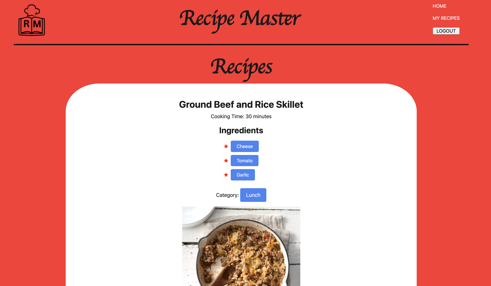

# recipe-master

## Description

Recipe Masters is a full-stack application, recipe discovery and platform for food enthusiasts. Users can explore and share recipes from all types of cuisines.
The search bar at the top of the page allows you to explore a collection of recipes based on ingredients, categories, and dietary preferences.
Users can join in on the collection by simply signing up or logging in to post and showcase their recipes.
Technologies Used:
Multer which is a module for image uploading.  
Node.js, Express.js, Handlebars.js
MySQL, Sequelize ORM
Authentication
Heroku web server

Deployed application link on GitHub
https://github.com/kuocats/Recipe_Masters

Deployed application link on Heroku
https://recipe-masters-july-c08367818636.herokuapp.com/

## Table of Contents

- [Installation](#installation)
- [Requirements](#requirements)
- [Usage](#usage)
- [Mock-Up](#mock-up)
- [Credits](#credits)
- [License](#license)

## Installation

No special requirements

## Requirements

No special requirements

## Usage

This website allows users to discover and post food recipes. Users will be able to search for recipes based on ingredients and categories. Users can also sign up, log in, and post their favorite food recipe to their profile.

## Mock-Up

Screenshot located in `./uploads/` folder.

## Credits

Documetation for the following npm packages were used to create this application:
https://www.npmjs.com/package/multer

Here documentation for Sequelize fearch by word
`[Op.like]: '%hat'`
https://sequelize.org/docs/v6/core-concepts/model-querying-basics/

## License

Please refer to the LICENSE in the repo.
